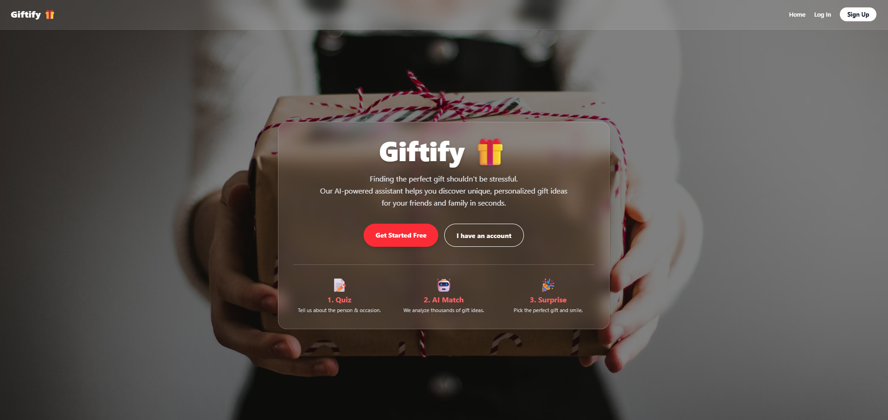
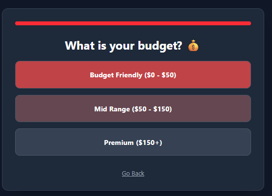
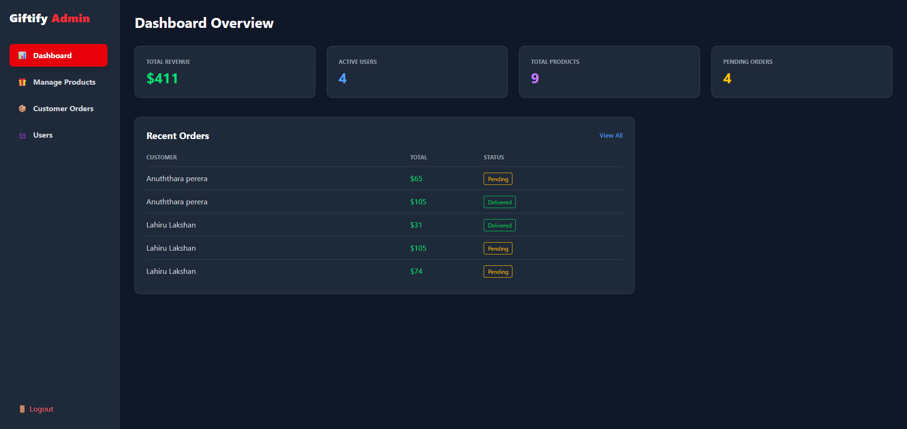
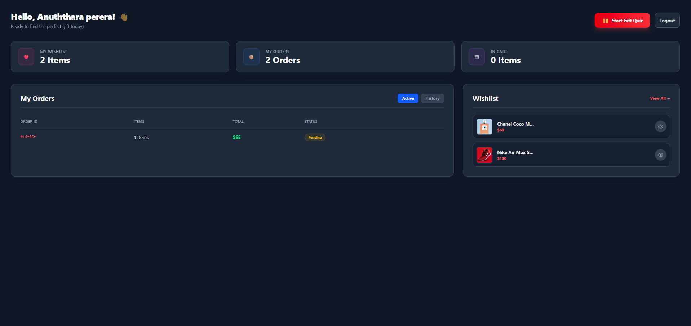
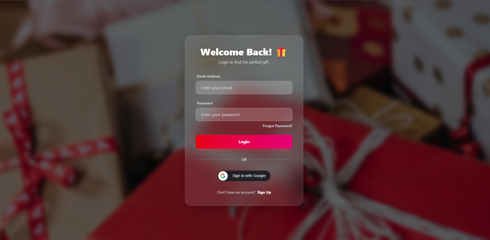

# 🎁 Giftify - Smart Gift Recommendation App
A modern, intelligent e-commerce platform built with React, TypeScript, and Tailwind CSS. It helps users find the perfect gift through an interactive quiz engine and features a stunning dark glassmorphism UI.

## 🚀 Live Demo
- **Frontend URL:** [Link to your Vercel/Netlify Deployment]
- **Backend Repository:** [Link to your Backend GitHub Repo]

---

## 🛠️ Technologies & Tools

- **Framework:** React.js (Vite)
- **Language:** TypeScript
- **Styling:** Tailwind CSS (Custom Dark Theme & Glassmorphism)
- **State Management:** React Context API
- **Routing:** React Router Dom
- **HTTP Client:** Axios (Service Layer Architecture)
- **Auth:** Google OAuth (`@react-oauth/google`) & JWT
- **Notifications:** Notistack
- **Icons:** React Icons (Feather/FontAwesome)

---

## ✨ Key Features

### 1. 🤖 Smart Gift Quiz Engine
- Interactive step-by-step wizard to collect user requirements.
- Filters products based on **Relationship** (Male, Female, Kids), **Occasion** (Birthday, Anniversary), and **Budget**.
- Intelligent tag-matching algorithm to suggest the most relevant items.

### 2. 🎨 Modern UI/UX
- **Glassmorphism Design:** Premium dark theme with blurred glass containers and neon accents.
- **Responsive:** Fully optimized for Mobile, Tablet, and Desktop.
- **Interactive Elements:** Smooth transitions, hover effects, and loading skeletons.

### 3. 🛍️ Seamless Shopping Experience
- **Cart Management:** Add items, manage quantities, and view real-time totals.
- **Gift Customization:** Option to add **Gift Wrapping** (+$5.00) and **Custom Messages** per item.
- **Wishlist:** Save favorite items to a personalized wishlist with a single click.

### 4. 👤 User Dashboard
- **Order History:** Tabbed view for **Active** vs **History** (Delivered) orders.
- **Real-time Stats:** View total items in the cart, wishlist count, and order status.
- **Profile Management:** Secure logout and session handling.

### 5. 🛡️ Admin Dashboard (CMS)
- **Overview Analytics:** Real-time stats on Total Revenue, Active Users, Products, and Pending Orders.
- **Product Management:** Full CRUD (Create, Read, Update, Delete) for gift items with image URLs and tags.
- **Order Management:** View customer orders, check gift-wrap status, and update delivery status (Pending -> Shipped -> Delivered).
- **User Control:** View registered users and manage access.

### 6. 🔐 Advanced Authentication
- **Secure Login/Signup:** Email & Password authentication with JWT.
- **Social Login:** One-click sign-in using **Google**.
- **Password Recovery:** Forgot Password & Reset Password flow via Email (Nodemailer/Mailtrap).

---

## 📸 Screenshots

### 🏠 Landing Page

### 📝 Gift Quiz & Recommendations

### 📊 Admin Dashboard

### 👤 User Dashboard

### 🔐 Login Page

---
## ⚙️ Environment Variables

Create a .env file in the root directory and add the following:

env
VITE_GOOGLE_CLIENT_ID=your_google_client_id_here

## 💻 Setup & Installation

1.  *Clone the repository*
    bash
    git clone https://github.com/Lahiru075/AI-travel-planner-fe.git
    cd your-frontend-repo
    

2.  *Install Dependencies*
    bash
    npm install
    

3.  *Run the Development Server*
    bash
    npm run dev
    

4.  *Build for Production*
    bash
    npm run build
    

## 📂 Project Structure

bash
src/
├── assets/         # Images and static files
├── components/     # Reusable UI components (Navbar, TripCard, Map, etc.)
├── context/        # Auth Context for global state management
├── pages/          # Main application pages (Home, Dashboard, CreateTrip, Admin)
├── routes/         # App navigation & protected route logic (index.tsx)
├── service/        # API service functions (Axios calls to Backend)
├── App.tsx         # Root component
└── main.tsx        # Entry point

## 👨‍💻 Author

*   *Sandaru Perera* - [GitHub Profile](https://github.com/Anuththara2003)
